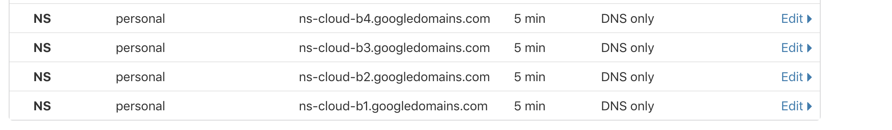
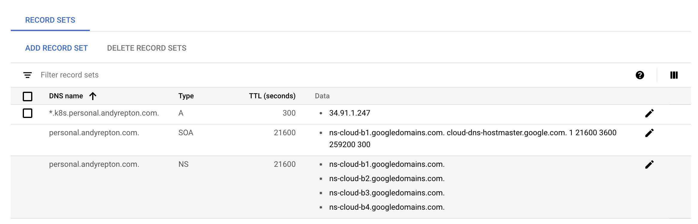
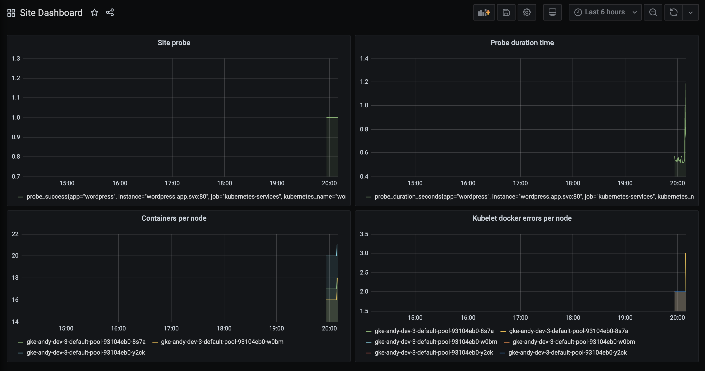
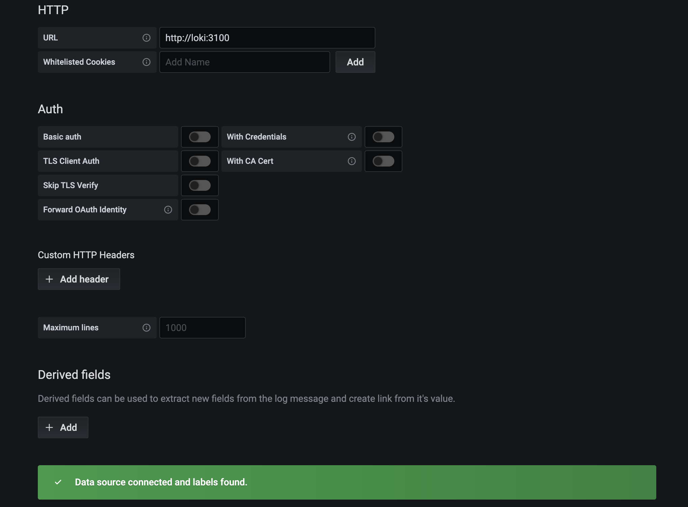
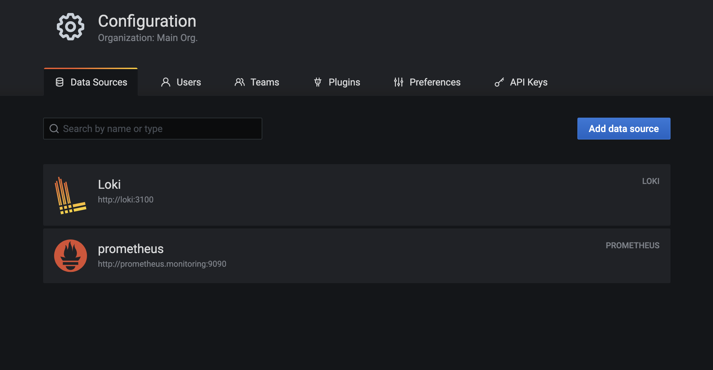
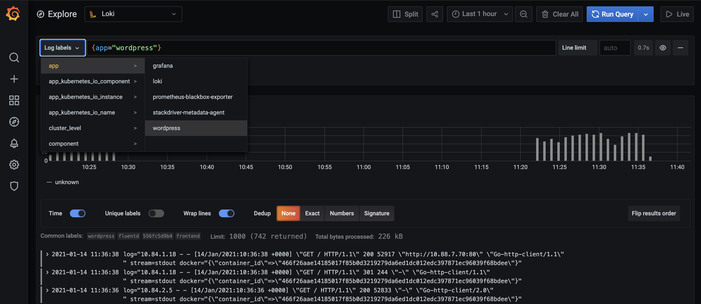

# Kubernetes Testbed - An attempt to build up a best practise Kubernetes environment step by step

Disclaimer: this is an experiment for myself to build a new system from scratch to keep my skills up to date, I make no promises as to how secure this is! Please review before copying code.

There are various folders here that start as a basic application and gradually add more complicated Kubernetes functionality. You can start at any folder; the changes are additive.

I have done my best to use Kustomize to add features to each section, so you could use this as a base for dev/acc/prod etc if desired.

# Contents

- [1. Deploying a wordpress app with a database and ingress](https://github.com/Seth-Karlo/Kubernetes-Testbed#1-deploying-a-wordpress-app-with-a-database-and-ingress)
- [1.a) Upgrade: adding an SSL certificate using LetsEncrypt staging](https://github.com/Seth-Karlo/Kubernetes-Testbed#1a-upgrade-adding-an-ssl-certificate-using-letsencrypt-staging)
- [1.b) Upgrade: adding an SSL certificate using LetsEncrypt production](https://github.com/Seth-Karlo/Kubernetes-Testbed#1b-upgrade-adding-an-ssl-certificate-using-letsencrypt-production)
- [2. Adding prometheus, blackbox exporter and grafana for monitoring. FluentD and Loki for logging.](https://github.com/Seth-Karlo/Kubernetes-Testbed#2-adding-prometheus-blackbox-exporter-and-grafana-for-monitoring-fluentd-and-loki-for-logging)
- [2.a) Upgrade: auto creating our prometheus data source and dashboard in grafana without a PVC](https://github.com/Seth-Karlo/Kubernetes-Testbed#2a-upgrade-auto-creating-our-prometheus-data-source-and-dashboard-in-grafana-without-a-pvc)
- [2.b) Upgrade: adding an ingress for our grafana system so we don't need to port forward](https://github.com/Seth-Karlo/Kubernetes-Testbed#2b-upgrade-adding-an-ingress-for-our-grafana-system-so-we-dont-need-to-port-forward)
- [3. Adding logging using fluentd and loki](https://github.com/Seth-Karlo/Kubernetes-Testbed#3-adding-logging-using-fluentd-and-loki)
- [3.a) Upgrade: Auto create our Loki data source within Grafana to stream our logs automatically](https://github.com/Seth-Karlo/Kubernetes-Testbed#3a-upgrade-auto-create-our-loki-data-source-within-grafana-to-stream-our-logs-automatically)
- [4. Securing our cluster with Network policies between namespaces](https://github.com/Seth-Karlo/Kubernetes-Testbed#4-securing-our-cluster-with-network-policies-between-namespaces)

# Plan:

1. Make a standard deployment
2. Add monitoring
3. Add logging
4. Add Network Policies
5. Add Pod Security Policies
6. Add alerting and link to third party software
7. Whatever I think up next

## Architecture

### A basic website with segregated namespaces

#### Frontend

**Note**: I am using the domain `k8s.personal.andyrepton.com` for this, you should substitute your own domain name if wanting to use certificates from LetsEncrypt

- An Ingress with Nginx, set to best practises with TLS 1.3, a valid SSL certificate etc
- Access allowed to Admin, SysAdmin
- Port 443 and port 80 allowed inbound

#### The App layer

- A basic wordpress website
- Access allowed to Admin, SysAdmin
- Port 443 allowed from Frontend

#### The Database layer

- A basic MySQL deployment
- Access allowed to Admin, SysAdmin
- Port 3389 allowed from App

#### The monitoring system

- A prometheus and blackbox system
- Access allowed to Admin, SysAdmin, read only access allowed to auditor
- Port 9090 allowed from Observability

#### The logging system

- A fluentd system that aggregates logs

#### The observability system

- Grafana, with Loki, as a frontend to Prometheus and FluentD
- Access allowed to Admin, SysAdmin, read only access allowed to auditor
- Port 3100 allowed inbound from Frontend and logging

## The (eventual) ground rules:

- Network policies should isolate the systems from each other
- Pod Security Policies should be best practise
- There should be three roles: Admin (access to everything), SysAdmin (Access to the application, but no K8S namespaces), and auditor (Access to view logs, and monitoring/logging namespaces, but no edit rights)

## General notes

- I'm not using Persistent Volumes to save money. The focus here is on configuration and security, not a 'working' Wordpress site that persists across reboots. I may make a version including these in the future.
- You need to bring your own domain name
- I'm assuming you have a Kubernetes cluster already

# 1. Deploying a wordpress app with a database and ingress

- `cd 1.Basic-App`

## Overview:

In this section, we're deploying a standard deployment pod (wordpress), with a MySQL backend deployment in a different namespace, and an Ingress controller in front. The system uses kustomize to generate a mysql Password (You should change the password in here) and deploy the system. The namespaces are created individually first.

## Deploying:

1. `kubectl apply -f namespaces.yml`
2. Check things look valid with `kubectl diff -k ./`
3. Apply with `kubectl apply -k ./`
4. If you get the error `Error from server (InternalError): error when creating "./": Internal error occurred: failed calling webhook "validate.nginx.ingress.kubernetes.io": Post https://ingress-nginx-controller-admission.ingress-nginx.svc:443/networking/v1beta1/ingresses?timeout=10s: no endpoints available for service "ingress-nginx-controller-admission"`, wait a couple of minutes and try again.
5. Get the IP address of your load balancer by using `kubectl -n frontend get svc`.
6. Set the A record of your subdomain name to point to this IP address. I have set *.k8s.personal.andyrepton.com to the IP address here.

### Alternative option: Moving the nameservers for the domain to GCP

As I want to in the future have Kubernetes automatically set up my global DNS for me, I've moved the nameservers of personal.andyrepton.com to my GCP project by setting the following in Cloudflare:

And here is what it looks like in Cloudflare:


And then setting my A record in GCP directly:



# 1.a) Upgrade: adding an SSL certificate using LetsEncrypt staging

- `cd 1.a.Basic-App-with-TLS-staging`

## Overview:

Let's Encrypt has a staging service that you can use to test your configuration before you proceed to prod and potentially lock yourself out of the LE API. First up you need to make an 'Issuer' for Lets Encrypt, identifying yourself. You can either make an Issuer (locked to a namespace) or a ClusterIssuer (for anything in the cluster) that can be used to request a certificate.

## Deploying:

1. **Important** edit the your-info.yml and set your email address correctly
2. Apply with `kubectl apply -k ./`
3. Browse to your website after a minute or so and you should see you now have a LetsEncrypt Staging certificate

# 1.b) Upgrade: adding an SSL certificate using LetsEncrypt production

- cd `1.b.Basic-App-with-TLS-prod`

## Overview:

We're not going to replace this with a valid SSL certificate using the production letsencrypt provider. We'll make a new issuer with the production API of LE. You can take a look at the differences by looking at the frontend/cert-manager-prod.yml file. We're using kustomize to overwrite the email once again via the your-info.yml file.

## Deploying:

1. **Important** edit the your-info.yml and set your email address correctly
2. Apply with `kubectl apply -k ./`
3. Browse to your website after a minute or so and you should see you now have a valid LE certificate

# 2. Adding prometheus, blackbox exporter and grafana for monitoring. FluentD and Loki for logging.

- cd `2.Adding-Monitoring`

## Overview:

For our application, we want to ensure it is monitored. We're going to use Prometheus to scrape our Kubernetes targets, along with the blackbox exporter to check our site. We'll view these in an observability namespace with Grafana. Later, we'll add some alerts to our prometheus system and add an additional Ingress to allow access to the system with auth.

The prometheus deployment is relatively straight-forward, using a config map to hold our configuration. In addition, we've added a section that calls out to the blackbox exporter to test our ingresses automatically:

```        - target_label: __address__
          replacement: prometheus-blackbox-exporter:9115```

## What's changed?

- Addition of a prometheus deployment to the monitoring namespace
- Addition of a config map for prometheus to set up the config to auto-discover Kubernetes endpoints and scrap them
- Addition of a blackbox exporter deployment
- Addition of a grafana instance to the observability namespace

## Deploying:

1. Edit the `kustomize.yml` file to set a username and password for your grafana instance
2. Check things look valid with `kubectl diff -k ./`
3. Apply with `kubectl apply -k ./`
4. You can now use the `kubectl port-forward` command to connect to your prometheus or grafana instance and confirm you can log in, using the username and password you set in the kustomization.yml file

# 2.a) Upgrade: auto creating our prometheus data source and dashboard in grafana without a PVC

- `cd 2.a.Auto-Importing-Monitoring-Dashboards`

## Overview

Using a PVC to hold our dashboard and data source info is an inefficient way to store our grafana config, so let's import it on startup using a Kubernetes Job. This is inspired by Giant-Swarm, so many thanks to them for the original code. You can see that here: https://github.com/giantswarm/prometheus/blob/master/manifests/grafana/

## What's changed?

- Addition of a config map containing our Grafana data source and dashboard code
- Addition of a job that reads this config map and POSTs it to the Grafana API to automatically create our grafana config on startup

## Deployment

1. Check things look valid with `kubectl diff -k ./`
2. Apply with `kubectl apply -k ./`
3. If you check the pods, you can see the job starting up:

```➜  k -n observability get pods
NAME                              READY   STATUS     RESTARTS   AGE
grafana-6fb4cb9bd4-mf69w          1/1     Running    0          11s
grafana-import-dashboards-t54xp   0/1     Init:0/1   0          11s
```

4. You can now port-forward again, and you'll see a new dashboard created, along with a data source linking to our existing prometheus system


# 2.b) Upgrade: adding an ingress for our grafana system so we don't need to port forward

- `cd 2.b.Adding-Monitoring-Ingress`

## Overview

While using a port-forward is one way of reaching our app, we can add a second ingress to allow us HTTPS access from outside of the cluster without needing to give kubectl access to an auditor for example.

## What's changed?

- Addition of an ingress for our grafana deployment so we can give access without needing kubectl access

## Deployment

1. Edit the `your-info.yml` file to add in your domain name for your grafana instance
2. Check things look valid with `kubectl diff -k ./`
3. Apply with `kubectl apply -k ./`
4. You should now be able to reach your grafana instance via the domain name you set in the `your-info.yml` file.

# 3. Adding logging using fluentd and loki

- `cd 3.Adding-Logging`

## Overview:

For our application, we want to ensure it is monitored and that we can browse the logs in an easy manner. We're going to use Prometheus to scrape our Kubernetes targets, and FluentD with Loki (from Grafana) to aggregate our logs. We'll view these in an observability namespace with Grafana. In addition, we'll use the blackbox exporter to test the frontend of our wordpress app. Finally, we'll add some alerts to our prometheus system and add an additional Ingress to allow access to the system with auth.

## What's changed:

- Addition of a fluentd daemonset to our cluster, that is gathering logs per node. On startup, we're using `fluentd-gem` to install the `fluent-plugin-grafana-loki` plugin to allow fluentd to communicate with loki
- Addition of configmap that holds our fluentd config to parse our application logs and our kubernetes logs, and send the labels through to Loki
- Addition of a Loki deployment to our observability namespace, as an endpoint for our fluentd daemonset
- Addition of a dedicated service account for fluentd to have the privileges to read Kubernetes API endpoints

## Deployment:

1. Edit the `your-info.yml` file to add in your domain name for your grafana instance
2. Check things look valid with `kubectl diff -k ./`
3. Apply with `kubectl apply -k ./`
4. You should now be able to reach your grafana instance via the domain name you set in the `your-info.yml` file. Here, you can connect to your loki instance by adding a data source to Loki as follows:



# 3.a) Upgrade: Auto create our Loki data source within Grafana to stream our logs automatically

- `cd 3.a.Auto-Importing-Logging-DataSource`

## Overview:

Automation for the win! Time to automatically add our loki data source to the Grafana container on startup.

## What's changed

- Editing the Grafana config-map to automatically add the loki data source too

## Deployment

1. Delete the grafana auto-import job using `kubectl -n observability delete job grafana-import-dashboards`
2. Edit the `your-info.yml` file to add in your domain name for your grafana instance
3. Check things look valid with `kubectl diff -k ./`
4. Apply with `kubectl apply -k ./`

And now we should see our datasource auto created:



5. We can now view our logs streaming in!



# 4. Securing our cluster with Network policies between namespaces

- `cd 4.Introducing-Network-Policies`

## Overview:

Now that we have multiple namespaces, we can start adding network policies to restrict the traffic between them. If a pod is compromised, we don't want to allow access to the other namespaces. For this section to work, you'll need to have a networking system that can use Network Policies. For my cluster I'm using Calico. (Other network providers are available :-D )

For now, I've avoided adding egress network policy rules as matching everything like DNS etc seemed overkill, but I might add egress as a 4.a section in the future.

## Deployment

1. Edit the `your-info.yml` file to add in your details
2. Check things look valid with `kubectl diff -k ./`
3. Apply with `kubectl apply -k ./`
4. You should now be able to see your network policies applied. If everything went correctly, everything should be working as before!
